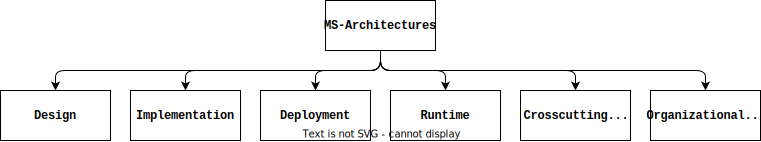

# Choosing the Right Microservices: A Taxonomy for Decision-Makers

In the ever-evolving realm of microservices architecture, understanding and selecting the right components is paramount. Join us on a journey as we unveil a comprehensive taxonomy and analysis framework designed to shed light on the intricacies of the entire microservices lifecycle, organizational aspects, and state-of-the-art approaches, empowering you to make informed decisions in the world of microservices.

## Why microservices?

Microservices (**MS**) were introduced as an architectual style, addressing the shortcommings of monolythic architectures.
MS enable building small component inside specified domain bounds, which are easy to understand, deploy and scale,\
additionaly enabling usage of different technology stacks.
 
Furthermore MS promote a vertical split of developer teams, where each team consist of experts for Interface-Design, Backend-Development and Database-Experts. This approach enables fast development of small services, reducing the time-to-market of new business-capabilities, resulting in more frequent feedback loops.

## Sounds great! What is missing?

Classical software development approaches benefit from suffisticated frameworks and models supporting the whole **development lifecycle**, **deployment** and additional aspects such as documentation of non-functional properties, for **different architectures**.

The increasing number of MS-based approaches and architectures requires equally suffisticated frameworks to asses and classify these.

## Classification Framework for MS based architectures

Before presenting the framework, first clarify what a MS-based architecture is:

> A method for creating a single application 
> by dividing it into a set of small services,
> each operating independently in its own process
> and interacting through lightweight mechanisms, frequently utilizing an HTTP API[^1]."

**The Framework**

| Stages | What is it about? | Concrete Example |
|--|--|--|
| **Design** | Classification of Design-Approach, Practises and Architectural support.| Greenfield Design, Domain-Driven-Design, Design Patterns |
| **Implementation** | Technology-Stack, Service-Interfaces, Supporting systems (e.g. Data Storage / Service Discovery).| Object-Oriented languages, Asynchronous-Interaction, HTTP-Communication, Interface-Describtion Tech Tied: OpenAPI, NoSQL, Client-Side Service-Discovery  |
| **Deployment** | Deployment-Platform and Management of MS. | Public-Cloud (AWS), Kubernetes |
| **Runtime** | Virtualization, Control Loops, Quality-Assessment by Verification and Validation. | Docker-Containers, Monitoring-Prometheus, Testing during runtime. |
| **Crosscutting** **Concepts** | Availability, Reliability, Maintainability, Security, Scalability and Tool support. | Resilience Tests, Edge-Servers, Service-templates, Security-Contracts, Vendor-provided-Scale(AWS), (Design-Tools, Programming Frameworks, Testing-suites, Deployment-tools) |
| **Organizational** **Aspects** | Organization of teams and development style. | DevOps, CI/CD/CM |

## Conclusion

Supporting the development of your application by classifying the different methods, concepts and tools used,\
provides a clearer understanding of your architecture for yourself and other developers joining your team.\
Moreover it enables you to think and communicate on a higher abstraction level about your architecture, which is neccessary, as applications quickly reach a certain complexity level, making it hard to zoom out and understand the big picture without loosing important information.
In addition it promotes the *Keep It Simple* principle, as you can compare architectures, identify similarities and adopt common concepts.

---
Based on paper: [Towards a Taxonomy of Microservices
Architectures](https://link.springer.com/chapter/10.1007/978-3-319-74781-1_15)

[^1]: Lewis, J., Fowler, M.: Microservices (2014). http://martinfowler.com/articles/
microservices.html